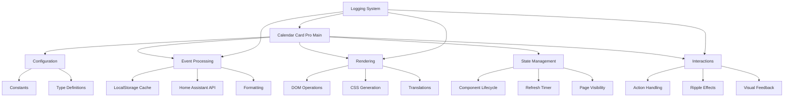

# Calendar Card Pro Architecture

This document provides a high-level overview of the Calendar Card Pro architecture, explaining how different modules work together to create a performant and maintainable calendar card for Home Assistant.

## Directory Structure

```
src/
├── calendar-card-pro.ts          # Main entry point and component class
├── config/                       # Configuration-related code
│   ├── config.ts                 # DEFAULT_CONFIG and config helpers
│   ├── constants.ts              # Application constants and defaults
│   └── types.ts                  # TypeScript interface definitions
├── interaction/                  # User interaction handling
│   ├── actions.ts                # Action execution (tap, hold, etc.)
│   └── feedback.ts               # Visual feedback (ripple, hold indicators)
├── rendering/                    # UI rendering code
│   ├── editor.ts                 # Card editor component
│   ├── render.ts                 # Component rendering functions
│   └── styles.ts                 # CSS styles and dynamic styling
├── translations/                 # Localization support
│   ├── localize.ts               # Translation functions
│   └── languages/                # Translation files (24 supported languages)
│       ├── en.json               # English translations
│       ├── de.json               # German translations
│       └── ...                   # Other language files
└── utils/                        # Utility functions
    ├── events.ts                 # Calendar event fetching and processing
    ├── format.ts                 # Date and text formatting
    ├── helpers.ts                # Generic utilities (color, ID generation)
    └── logger.ts                 # Logging system
```

## Module Responsibilities

### Main Component (`calendar-card-pro.ts`)

The main entry point serves as the orchestrator for the entire card:

- **Web Component Registration**: Defines the custom element using `@customElement` decorator
- **Lifecycle Management**: Handles component connection, disconnection, and updates
- **Property Definition**: Defines reactive properties via LitElement's `@property` decorator
- **State Management**: Manages loading state, expanded state, and events data
- **Event Handling**: Sets up user interaction handling (tap, hold, keyboard)
- **Configuration Processing**: Handles config updates from Home Assistant
- **Rendering Coordination**: Builds the component's DOM structure

Key design patterns:

- Uses [LitElement](https://lit.dev/) for efficient DOM updates and property management
- Follows Home Assistant's component conventions for seamless integration
- Implements computed properties via getters for derived state

### Configuration (`config/`)

Manages all configuration aspects of the card:

- **config.ts**:

  - Defines default configuration (`DEFAULT_CONFIG`)
  - Provides helper functions for normalizing entity configurations
  - Detects configuration changes that require data refresh
  - Generates stub configurations for the card editor

- **constants.ts**:

  - Defines global constants organized by category
  - Sets default values and timing parameters
  - Centralizes cache-related settings

- **types.ts**:
  - Defines TypeScript interfaces for all component parts
  - Documents config properties and their purposes
  - Provides type safety throughout the application

### Interaction (`interaction/`)

Handles all user interaction with the card:

- **actions.ts**:

  - Processes user actions (tap, hold, etc.)
  - Dispatches Home Assistant events
  - Handles navigation and service calls
  - Manages toggle/expand actions

- **feedback.ts**:
  - Creates visual feedback for user interactions
  - Manages hold indicators with proper timing
  - Handles cleanup of temporary DOM elements

### Rendering (`rendering/`)

Generates the HTML and CSS for the card:

- **render.ts**:

  - Contains pure functions for rendering card elements
  - Generates HTML templates for days, events, and states
  - Uses the lit-html templating system
  - Implements optimized rendering of event lists

- **styles.ts**:

  - Defines CSS styles as LitElement templates
  - Generates dynamic style properties based on configuration
  - Manages theme variable integration

- **editor.ts**:
  - Implements the card configuration editor
  - Handles schema validation for the editor UI

### Translations (`translations/`)

Provides internationalization support:

- **localize.ts**:

  - Manages language detection and selection
  - Handles translation lookups with fallbacks
  - Formats dates according to locale-specific patterns

- **languages/\*.json**:
  - Contains translation strings for each supported language
  - Defines month names, day names, and UI strings

### Utilities (`utils/`)

Provides core functionality across the card:

- **events.ts**:

  - Fetches calendar events from Home Assistant API
  - Implements caching system for calendar data
  - Processes and filters events based on configuration
  - Groups events by day for display

- **format.ts**:

  - Formats dates and times for display
  - Handles all-day and multi-day events
  - Processes location strings
  - Manages time formatting (12/24 hour)

- **helpers.ts**:

  - Provides color manipulation utilities
  - Generates deterministic IDs for caching
  - Implements hash functions for cache keys

- **logger.ts**:
  - Provides tiered logging system
  - Handles error, warning, info, and debug messages
  - Includes version information in logs

## Module Interaction Flow



## Data Flow

### Event Data Flow

1. **Initial Load**:
   - Component initializes and calls `updateEvents()`
   - `events.ts` generates a cache key based on configured entities and settings
   - Cache is checked first, API used only if needed
   - Events are stored in local storage with configurable expiration
2. **Data Processing**:

   - Raw calendar events are filtered for relevant dates
   - Events are grouped by day using `groupEventsByDay()`
   - Each event is enhanced with formatted time and location strings
   - Entity-specific styling is applied to each event

3. **Rendering Flow**:

   - Main component calls `render()` which uses the `Render` module
   - Dynamic styles are generated based on configuration
   - Days and events are rendered with proper CSS classes
   - Loading, error, and empty states are handled appropriately

4. **Refresh Mechanisms**:
   - Automatic refresh via `refresh_interval` configuration
   - Manual refresh when page visibility changes
   - Forced refresh when configuration changes
   - Cache invalidation based on timing and parameters

### Interaction Flow

1. **User Input**:
   - Pointer events (mouse/touch) captured in main component
   - Hold detection with visual feedback
   - Keyboard navigation support
2. **Action Execution**:
   - `actions.ts` handles tap/hold actions
   - Expansion toggle, navigation, and service calls
   - Home Assistant service integration

## Optimizations

### Performance Optimizations

1. **Smart Caching**:

   - Cached event data with configurable lifetime
   - Deterministic cache keys based on configuration
   - Selective cache invalidation

2. **Efficient Rendering**:

   - Pure rendering functions to improve performance
   - Stable DOM structure for card-mod compatibility
   - Efficient updates with lit-html

3. **Resource Management**:
   - Proper cleanup on disconnection
   - Event listener management
   - Timer cleanup

### UX Optimizations

1. **Progressive Loading**:
   - Clean loading states during data fetching
   - Optimized transitions between states
2. **Adaptive Display**:

   - Compact/expanded view modes
   - Empty state handling
   - Responsive sizing

3. **Visual Feedback**:
   - Material ripple effects
   - Hold indicators
   - Focus states for keyboard navigation

## Advanced Features

### Start Date Configuration

The card supports a `start_date` configuration option that allows viewing calendar data from any specified date rather than just today:

1. **Date Parsing**: Handles both YYYY-MM-DD format and ISO format
2. **API Integration**: Uses the start date to fetch the appropriate time window from the API
3. **Cache Integration**: Includes the start date in cache keys to ensure proper data refresh when changed

### Multi-Calendar Styling

Each calendar entity can have custom styling:

1. **Per-Entity Colors**: Customize text color by calendar source
2. **Accent Colors**: Vertical line colors for visual separation
3. **Background Colors**: Optional semi-transparent backgrounds
4. **Labels**: Entity-specific labels or emoji for visual differentiation

### Smart Event Formatting

Event display adapts based on event type:

1. **All-Day Events**: Special handling for single and multi-day all-day events
2. **Ongoing Events**: Shows "Ends today/tomorrow" for multi-day events
3. **Past Event Styling**: Visual distinction for events that have ended
4. **Location Processing**: Smart location string formatting with country removal

### Progressive Rendering

The calendar card implements efficient rendering to maintain responsiveness even with many events:

1. **Pure Function Pattern**: Render functions are implemented as pure functions that generate TemplateResults
2. **Stable DOM Structure**: The card maintains a consistent DOM structure for compatibility with card-mod
3. **Efficient Updates**: Uses lit-html's efficient diffing algorithm to minimize DOM operations

```typescript
// Example of pure function rendering approach
export function renderEvent(
  event: Types.CalendarEventData,
  day: Types.EventsByDay,
  index: number,
  config: Types.Config,
  language: string,
): TemplateResult {
  // Determine styles and classes based on event properties
  const eventClasses = {
    event: true,
    'event-first': index === 0,
    'event-last': index === day.events.length - 1,
    'past-event': isPastEvent(event),
  };

  // Return immutable template
  return html`
    <tr>
      ${index === 0 ? html`<td class="date-column" rowspan="${day.events.length}">...</td>` : ''}
      <td class=${classMap(eventClasses)} style=${styleMap(eventStyles)}>
        <!-- Event content -->
      </td>
    </tr>
  `;
}
```

### Smart Caching

The card implements a multi-level caching strategy:

1. **Event Data Caching**:

   - Calendar events are cached in localStorage
   - Cache key includes entities, days to show, past events setting, and start date
   - Cache invalidation is automatic when configuration changes
   - Cache duration is configurable through refresh_interval setting

2. **Deterministic IDs**:

   - Each card instance generates a deterministic ID based on configuration
   - The ID remains stable across page loads but changes when configuration changes
   - This ensures proper cache handling when multiple calendar cards exist

3. **Intelligent Cache Refresh**:
   - Cache is refreshed automatically based on configured interval
   - Manual refreshes are rate-limited to prevent API abuse
   - Reactive to page visibility changes and Home Assistant reconnection events

## Design Principles

The code follows these core principles:

1. **Separation of Concerns**:

   - Each module has a clear, focused responsibility
   - Pure functions where possible for easier testing
   - Clear interfaces between subsystems

2. **Progressive Enhancement**:

   - Works with minimal configuration
   - Gracefully handles missing data or API errors
   - Degrades elegantly in constrained environments

3. **Type Safety**:

   - Comprehensive TypeScript interfaces
   - Minimal use of `any` type
   - Runtime type guards where needed

4. **Maintainability**:
   - Consistent code style and patterns
   - Detailed comments and documentation
   - Clear function signatures and module organization

## Maintenance Guidelines

When modifying code:

1. **Module Boundaries**:

   - Keep changes within appropriate module boundaries
   - Update related modules when necessary
   - Follow existing patterns for consistency

2. **Type Safety**:

   - Update types in types.ts when changing data structures
   - Use type annotations for clarity
   - Avoid using `any` type when possible

3. **Testing Considerations**:

   - Test with various calendar types (Google Calendar, CalDAV, etc.)
   - Test with different screen sizes and device types
   - Test with large calendar datasets for performance

4. **Performance**:

   - Consider performance implications of new features
   - Use pure functions for rendering components
   - Implement appropriate caching for expensive operations

5. **Cleanup**:

   - Always clean up event listeners and timers
   - Manage memory carefully, especially for long-lived components
   - Implement proper disconnectedCallback handling

6. **Configuration**:
   - Make new features configurable when appropriate
   - Provide sensible defaults in constants.ts
   - Document new configuration options in README.md

By following these architectural principles, Calendar Card Pro maintains a clean, maintainable codebase that delivers excellent performance and user experience.
