# Calendar Card Pro Architecture

This document provides a high-level overview of the Calendar Card Pro architecture, explaining how different modules work together to create a performant and maintainable calendar card for Home Assistant.

## Directory Structure

```
src/
├── calendar-card-pro.ts          # Main entry point and component class
├── config/                       # Configuration-related code
│   ├── config.ts                 # DEFAULT_CONFIG and config helpers
│   ├── constants.ts              # Application constants and defaults
│   └── types.ts                  # TypeScript interface definitions
├── interaction/                  # User interaction handling
│   ├── actions.ts                # Action execution (tap, hold, etc.)
│   ├── core.ts                   # Interaction setup and management
│   ├── feedback.ts               # Visual feedback components (indicators)
│   └── ripple.ts                 # Custom ripple effect component
├── rendering/                    # UI rendering code
│   ├── editor.ts                 # Card editor component
│   ├── render.ts                 # HTML generation & progressive rendering
│   └── styles.ts                 # Dynamic CSS generation
├── translations/                 # Localization support
│   ├── localize.ts               # Translation functions and management
│   └── languages/                # Translation files
│       ├── en.json               # English translations
│       └── de.json               # German translations
└── utils/                        # Utility functions
    ├── dom.ts                    # DOM creation and manipulation
    ├── events.ts                 # Calendar event fetching and processing
    ├── format.ts                 # Date and text formatting
    ├── helpers.ts                # Generic utilities (debounce, memoize)
    ├── logger.ts                 # Logging system with levels
    └── state.ts                  # Component lifecycle management
```

## Module Responsibilities

### Main Component (`calendar-card-pro.ts`)

- **Primary Role**: Entry point and orchestrator for the card
- **Responsibilities**:
  - Web component lifecycle management
  - Home Assistant integration and data binding
  - Event handling and state management
  - Rendering coordination
  - Registering custom elements with the browser
  - Performance measurement and optimization

### Configuration (`config/`)

- **Primary Role**: Manage configuration data and types
- **Key Files**:
  - `config.ts`:
    - Default configuration values
    - Entity normalization
    - Configuration change detection
    - Stub configuration generation
  - `constants.ts`:
    - Application-wide constants
    - Default values for all settings
    - Timing, cache, and UI constants
  - `types.ts`:
    - TypeScript interfaces for all components
    - Calendar event data structures
    - Configuration interface
    - Home Assistant interfaces

### Interaction (`interaction/`)

- **Primary Role**: Handle user interactions with the card
- **Key Files**:
  - `actions.ts`:
    - Action execution (tap, hold, etc.)
    - Home Assistant service calls
    - Navigation and URL handling
  - `core.ts`:
    - Interaction setup and event binding
    - Primary entity identification
    - Touch and keyboard interaction support
  - `feedback.ts`:
    - Visual feedback indicators
    - Hold indicator creation and animation
    - Visual feedback cleanup
  - `ripple.ts`:
    - Custom ripple effect component
    - Touch feedback using LitElement
    - Integration with Home Assistant ripple

### Rendering (`rendering/`)

- **Primary Role**: Generate HTML and CSS for the card
- **Key Files**:
  - `render.ts`:
    - Card content generation
    - Progressive rendering for performance
    - Error and loading states
    - Day and event rendering
  - `styles.ts`:
    - Dynamic CSS generation
    - Custom property generation
    - Error state styling
  - `editor.ts`:
    - Card configuration editor (placeholder/future)

### Translations (`translations/`)

- **Primary Role**: Provide internationalization support
- **Key Files**:
  - `localize.ts`:
    - Translation functions
    - Language detection and fallback
    - Date and time formatting
    - Language management
  - `languages/*.json`:
    - Dictionary files for supported languages
    - Day, month, and special string translations

### Utilities (`utils/`)

- **Primary Role**: Provide core functionality used across the card
- **Key Files**:
  - `dom.ts`:
    - DOM element creation and manipulation
    - Card structure generation
    - Shadow DOM updates
  - `events.ts`:
    - Calendar event fetching from Home Assistant API
    - Event caching and processing
    - Event grouping and filtering
    - Cache management
  - `format.ts`:
    - Date and time formatting
    - Location formatting
    - Event time display logic
  - `helpers.ts`:
    - Generic utilities like debounce and memoize
    - Performance tracking
    - ID generation
  - `logger.ts`:
    - Structured logging system
    - Log level filtering
    - Error handling and formatting
  - `state.ts`:
    - Component state initialization
    - Lifecycle management
    - Visibility and refresh management
    - Resource cleanup

## Module Interaction Flow

```mermaid
graph TD
    Main[Calendar Card Pro Main] --> Config[Configuration]
    Main --> Events[Event Processing]
    Main --> Render[Rendering]
    Main --> State[State Management]
    Main --> Inter[Interactions]

    %% Configuration interactions
    Config --> Constants[Constants]
    Config --> Types[Type Definitions]

    %% Event processing flow
    Events --> Cache[LocalStorage Cache]
    Events --> API[Home Assistant API]
    Events --> Format[Formatting]

    %% Rendering flow
    Render --> DOM[DOM Operations]
    Render --> Styles[CSS Generation]
    Render --> Localize[Translations]

    %% Interaction flow
    Inter --> Actions[Action Handling]
    Inter --> Ripple[Ripple Effects]
    Inter --> Feedback[Visual Feedback]

    %% State management
    State --> Lifecycle[Component Lifecycle]
    State --> Refresh[Refresh Timer]
    State --> Visibility[Page Visibility]

    %% Cross-cutting concerns
    Logger[Logging System] --> Main
    Logger --> Events
    Logger --> Render
    Logger --> Inter

    %% Design notes
    classDef core fill:#f9f,stroke:#333,stroke-width:2px
    classDef util fill:#bbf,stroke:#333,stroke-width:1px
    classDef interact fill:#fdb,stroke:#333,stroke-width:1px

    class Main,Events,Render,State,Inter core
    class Config,Constants,Types,Format,DOM,Styles,Localize util
    class Actions,Ripple,Feedback interact
```



## Data and Event Flow

### Calendar Data Flow

1. **Initial Load**:

   - Component initializes with empty event array
   - `updateEvents()` is called during initialization
   - `events.ts` orchestrates data loading through `orchestrateEventUpdate()`
   - Cache is checked first, if valid data exists it's used immediately
   - Otherwise, API calls fetch data from Home Assistant calendars
   - Events are stored in localStorage cache with configurable expiration
   - Component state is updated with retrieved events
   - UI renders the calendar with the fetched events

2. **Refresh Mechanisms**:

   - **Regular Timer**: Events refresh every `refresh_interval` minutes (default: 30)
   - **Entity Changes**: Events refresh when calendar entity state changes
   - **Configuration Changes**: Events refresh when relevant configuration changes
   - **Visibility Change**: Events refresh when returning to tab after 5+ minutes
   - **Forced Refresh**: Methods can force bypass cache for immediate refresh

3. **Data Processing**:
   - Raw events are fetched from Home Assistant calendar API
   - Entity ID is attached to each event for source identification
   - Events are filtered based on configuration (show_past_events, etc.)
   - Events are grouped by day using `groupEventsByDay()`
   - Grouped events are then used for rendering

### Rendering Flow

1. **Progressive Rendering**:

   - `renderCard()` coordinates the rendering process
   - Performance measurement begins with `performanceTracker`
   - Error/empty/loading states are checked and rendered if needed
   - Events are grouped by day and filtered based on configuration
   - `renderCalendarCard()` generates the base structure
   - Content is rendered progressively in chunks to avoid blocking the UI
   - Each chunk renders after a small delay via promises
   - Card structure is assembled with interaction support
   - Performance metrics are collected throughout the process

2. **DOM Updates**:
   - Shadow DOM is cleared and updated with new content
   - Style element with dynamic CSS is inserted
   - Interaction handlers are set up with proper cleanup
   - Ripple effect is attached to card container

### Interaction Flow

1. **Touch/Mouse Interactions**:

   - User interaction (touch/click) triggers event listeners
   - Hold detection measures press duration
   - Visual feedback is shown for hold actions
   - Action is executed based on configuration (tap_action/hold_action)
   - Ripple effect provides visual confirmation

2. **Action Execution**:
   - Actions are routed through `handleAction()` in actions.ts
   - Different types of actions (navigate, more-info, toggle, etc.)
   - Home Assistant services can be called
   - Card expansion state can be toggled
   - URL navigation or custom events can be triggered

## Key Design Principles

### 1. Separation of Concerns

- Each module has well-defined responsibilities
- Files are organized by functional area
- Components communicate through clean interfaces
- Minimal dependencies between modules

### 2. Progressive Enhancement

- Card works in different environments and configurations
- Fallbacks are provided for error states
- Visual feedback adapts to device capabilities

### 3. Performance Optimization

- **Layered Caching**:

  - LocalStorage caching of calendar events
  - Memoization of expensive formatting operations
  - Configurable cache duration for user control

- **Efficient Rendering**:

  - Progressive rendering to avoid UI blocking
  - Chunked processing of large event sets
  - DOM recycling when possible
  - Performance measurement and logging

- **Resource Management**:
  - Careful cleanup of event listeners and timers
  - Memory leak prevention with explicit cleanup
  - Cache expiration and cleanup

### 4. Type Safety

- Comprehensive TypeScript interfaces
- Strong typing throughout the codebase
- Clear data models for all component parts
- Type guards for runtime safety

### 5. Modular Architecture

- Self-contained modules for maintainability
- Explicit dependencies between modules
- Clean interfaces for testing and reuse
- Organized by functional domain

## Advanced Features

### Progressive Rendering

The calendar card implements progressive rendering to maintain responsiveness even with many events:

1. Events are first sorted and grouped by day
2. Rendering occurs in configurable chunks (default: 10 items per chunk)
3. Small delays between chunks (default: 50ms) prevent blocking the main thread
4. Performance metrics track rendering time and optimize future rendering

```typescript
// Progressive rendering example from render.ts
export async function renderProgressively(
  days: Types.EventsByDay[],
  config: Types.Config,
  formatEventTime: (event: Types.CalendarEventData) => string,
  formatLocation: (location: string) => string,
  chunkSize = Constants.PERFORMANCE.CHUNK_SIZE,
  renderDelay = Constants.PERFORMANCE.RENDER_DELAY,
): Promise<DocumentFragment> {
  // ... initialization ...

  const renderChunk = async (startIdx: number): Promise<void> => {
    const chunk = days.slice(startIdx, startIdx + chunkSize);
    if (!chunk.length) return;

    chunk.forEach((day: Types.EventsByDay) => {
      // ... render day ...
    });

    if (startIdx + chunkSize < days.length) {
      await new Promise((resolve) => setTimeout(resolve, renderDelay));
      await renderChunk(startIdx + chunkSize);
    }
  };

  await renderChunk(0);
  return fragment;
}
```

### Smart Caching

The card implements a multi-level caching strategy:

1. **Event Data Caching**:

   - Calendar events are cached in localStorage
   - Cache key is derived from entities, days to show, and past event settings
   - Cache duration is configurable through `cache_duration` setting
   - Automatic cache invalidation when configuration changes

2. **Memory Caching**:

   - Expensive operations like time formatting use memoization
   - Memoization caches are properly managed to prevent memory leaks
   - Cache is cleaned up during component disconnection

3. **Cache Cleanup**:
   - Periodic cache cleanup prevents browser storage overflow
   - Expired cache entries are automatically removed
   - Cache multiplier determines when entries are eligible for cleanup

### Internationalization

The card supports multiple languages through a flexible localization system:

1. **Translation System**:

   - Dictionary-based translations in JSON format
   - Easy to extend with new languages
   - Automatic fallback to English for missing translations
   - Runtime language switching

2. **Date and Time Formatting**:

   - Language-aware date and time formatting
   - Support for different date formats based on locale
   - 12/24 hour time format support
   - Smart formatting of multi-day and all-day events

3. **Location Formatting**:
   - Optional country removal from location strings
   - Smart handling of common country names

### Interaction Patterns

The card implements modern interaction patterns for intuitive use:

1. **Tap and Hold Actions**:

   - Configurable tap and hold actions
   - Visual feedback for interactions
   - Hold threshold with visual indicator
   - Touch and mouse support

2. **Material Ripple Effect**:

   - Custom ripple component for visual feedback
   - Integrates with Home Assistant styling
   - Configurable colors and opacity

3. **Accessibility**:
   - Keyboard navigation support
   - ARIA attributes for screen readers
   - High contrast visual design

## Maintenance Guidelines

When modifying code:

1. **Module Boundaries**:

   - Keep changes within appropriate module boundaries
   - Update related modules when necessary
   - Follow existing patterns for consistency

2. **Type Safety**:

   - Update types in types.ts when changing data structures
   - Use type annotations for clarity
   - Avoid using `any` type when possible

3. **Testing Considerations**:

   - Test with various calendar types (Google Calendar, CalDAV, etc.)
   - Test with different screen sizes and device types
   - Test with large calendar datasets for performance

4. **Performance**:

   - Consider performance implications of new features
   - Use progressive rendering for UI-heavy changes
   - Implement appropriate caching for expensive operations

5. **Cleanup**:

   - Always clean up event listeners and timers
   - Manage memory carefully, especially for long-lived components
   - Implement proper disconnectedCallback handling

6. **Configuration**:
   - Make new features configurable when appropriate
   - Provide sensible defaults in constants.ts
   - Document new configuration options

By following these architectural principles and guidelines, Calendar Card Pro maintains a clean, maintainable codebase that delivers excellent performance and user experience.
