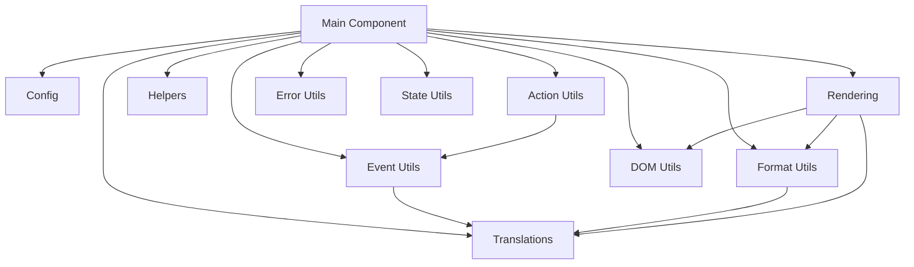

This document provides a high-level overview of the Calendar Card Pro architecture, explaining how different modules work together to create a performant and maintainable calendar card for Home Assistant.

## Directory Structure

```
src/
├── calendar-card-pro.ts          # Main entry point with class
├── config/                       # Configuration-related code
│   ├── config.ts                 # DEFAULT_CONFIG and config helpers
│   └── types.ts                  # Type definitions
├── translations/                 # Localization code
│   ├── localize.ts               # Translation functions and logic
│   └── languages/                # Individual language files
│       ├── en.json               # English translations
│       └── de.json               # German translations
├── utils/                        # Utility functions
│   ├── event-utils.ts            # Event processing, caching & formatting
│   ├── format-utils.ts           # Date & location formatting
│   ├── dom-utils.ts              # DOM creation and manipulation
│   ├── error-utils.ts            # Error handling and logging
│   ├── actions.ts                # Tap/hold action handling
│   ├── state-utils.ts            # Component state management
│   └── helpers.ts                # Generic utilities (debounce, memoize)
└── rendering/                    # UI rendering code
    ├── render.ts                 # HTML generation & rendering logic
    ├── styles.ts                 # Card styling
    └── editor.ts                 # Card editor component (placeholder)
```

## Module Responsibilities

### Main Component (`calendar-card-pro.ts`)

- **Primary Role**: Serves as the entry point and orchestrator for the card
- **Responsibilities**:
  - Web component lifecycle (constructor, disconnectedCallback)
  - State management and Home Assistant integration
  - Coordinating interactions between modules
  - Registering the custom elements with the browser

### Configuration (`config/`)

- **Primary Role**: Manage configuration defaults and processing
- **Key Files**:
  - `config.ts`: Default configuration and config-related helper functions
  - `types.ts`: TypeScript interfaces for all components

### Translations (`translations/`)

- **Primary Role**: Provide internationalization capabilities
- **Key Files**:
  - `localize.ts`: Core translation functions and registration
  - `languages/*.json`: Individual language translation files

### Utilities (`utils/`)

- **Primary Role**: Provide reusable functionality across the card
- **Key Files**:
  - `event-utils.ts`: Calendar event fetching, processing, caching
  - `format-utils.ts`: Formatting dates, times, and locations
  - `dom-utils.ts`: DOM element creation and manipulation utilities
  - `error-utils.ts`: Standardized error handling and logging
  - `actions.ts`: Handling user interactions (tap/hold)
  - `state-utils.ts`: Component state initialization and management
  - `helpers.ts`: Generic utilities like debounce, memoize, performance monitoring

### Rendering (`rendering/`)

- **Primary Role**: Generate HTML, CSS, and handle DOM manipulation
- **Key Files**:
  - `render.ts`: HTML generation and progressive rendering
  - `styles.ts`: CSS generation based on configuration
  - `editor.ts`: Card editor component (will be expanded later)

## Module Interaction Flow



1. **Initialization Flow**:

   - Main component initializes
   - `State Utils` set up initial component state
   - Establishes connection to Home Assistant

2. **Event Processing Flow**:

   - `hass` setter detects entity changes
   - `updateEvents()` calls `Event Utils` to fetch and process data
   - Events are cached and formatted for display

3. **Rendering Flow**:

   - `renderCard()` coordinates rendering process
   - `Event Utils` organize events by day
   - `Render` module generates HTML with `DOM Utils`
   - Uses progressive rendering for performance
   - `Styles` module applies CSS based on configuration

4. **Interaction Flow**:
   - User interactions trigger action handlers
   - UI is updated based on actions

## Key Design Principles

1. **Separation of Concerns**:

   - Each module has a well-defined responsibility
   - Minimizing dependencies between modules

2. **Performance Optimization**:

   - Aggressive caching of events and rendered output
   - Progressive rendering to avoid blocking the main thread
   - Memoization of expensive calculations

3. **Type Safety**:

   - TypeScript interfaces for all data structures
   - Strong typing within and between modules

4. **Modularity**:

   - Self-contained modules that can be independently tested
   - Clean interfaces between modules

5. **State Management**:
   - One-way data flow from Home Assistant to UI
   - Explicit state updates in response to events

## Advanced Features

### Progressive Rendering

To maintain responsiveness even with large calendars, rendering is done progressively:

1. Events are sorted and grouped by day
2. Days are rendered in chunks
3. Rendering is paused between chunks to allow other UI operations
4. Performance metrics are collected to identify bottlenecks

### Caching Strategy

Multiple caching mechanisms are used:

1. **Local Storage Cache**: Persists between sessions
2. **In-Memory Cache**: For frequently accessed computed values
3. **Memoization**: For expensive utility functions

### Internationalization

The architecture supports multiple languages through:

1. Dictionary-based translations in JSON format
2. Runtime language switching
3. Formatting helpers that adapt to the selected language

## Maintenance Guidelines

When modifying code:

1. Keep modules focused on their core responsibilities
2. Update types in types.ts when changing data structures
3. Maintain backward compatibility when possible
4. Add performance monitoring for new features
5. Test with both small and large calendars
6. Ensure all features work with and without entity history

By understanding this architecture, you'll be able to maintain, extend, and contribute to the Calendar Card Pro project more effectively.
