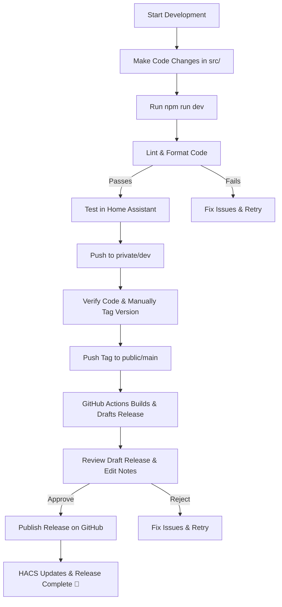

# 📌 Calendar Card Pro - End-to-End Development & Release Workflow

This document outlines the **complete** workflow for developing, testing, handling pull requests, and releasing updates to the **Calendar Card Pro** custom Home Assistant card.

---

## 🚀 Setting Up the Development Environment

Before you can start developing for Calendar Card Pro, you'll need to set up your local environment.

### Prerequisites

- **Node.js** (v16.x or newer) and **npm** (v7.x or newer)
- **Git** (v2.x or newer)
- A **code editor** (VS Code recommended for built-in TypeScript support)
- A local **Home Assistant** instance for testing (optional but recommended)

### Initial Setup

1. **Clone the repository**

   ```sh
   # For maintainers with access to private repo
   git clone https://github.com/yourusername/calendar-card-pro-dev.git
   cd calendar-card-pro-dev

   # For contributors using public repo
   git clone https://github.com/alexpfau/calendar-card-pro.git
   cd calendar-card-pro
   ```

2. **Install dependencies**

   ```sh
   # Install project dependencies
   npm install

   # Optionally install global tools (if you don't have them)
   npm install -g typescript eslint prettier rollup
   ```

3. **Set up development tools**

   For VS Code users, install recommended extensions:

   - ESLint
   - Prettier
   - TypeScript IDE Support

   Configure VS Code for auto-formatting on save:

   ```json
   // .vscode/settings.json
   {
     "editor.formatOnSave": true,
     "editor.defaultFormatter": "esbenp.prettier-vscode",
     "eslint.validate": ["typescript"],
     "editor.codeActionsOnSave": {
       "source.fixAll.eslint": true
     }
   }
   ```

4. **Verify setup**

   Ensure everything is working by building the project:

   ```sh
   # Build the project
   npm run build

   # Start development mode with auto-rebuilding
   npm run dev
   ```

   You should see output indicating a successful build with the compiled file in the `dist/` directory.

### Project Dependencies

Calendar Card Pro uses these primary dependencies:

- **TypeScript** - Strongly typed JavaScript
- **Rollup** - Module bundler
- **ESLint** - Code quality and style checking
- **Prettier** - Code formatting
- **Home Assistant Frontend Types** - TypeScript definitions for Home Assistant

All required dependencies are specified in `package.json` and will be installed with `npm install`. The main development dependencies include:

```
"devDependencies": {
  "@eslint/eslintrc": "^x.x.x",
  "@rollup/plugin-json": "^x.x.x",
  "@rollup/plugin-node-resolve": "^x.x.x",
  "@rollup/plugin-replace": "^x.x.x",
  "@rollup/plugin-terser": "^x.x.x",
  "@rollup/plugin-typescript": "^x.x.x",
  "@typescript-eslint/eslint-plugin": "^x.x.x",
  "@typescript-eslint/parser": "^x.x.x",
  "eslint": "^x.x.x",
  "eslint-config-prettier": "^x.x.x",
  "eslint-plugin-import": "^x.x.x",
  "eslint-plugin-prettier": "^x.x.x",
  "prettier": "^x.x.x",
  "rollup": "^x.x.x",
  "tslib": "^x.x.x",
  "typescript": "^x.x.x"
}
```

---

## 📂 Repository Structure

```plaintext
calendar-card-pro-dev/
│── .github/
│   ├── workflows/
│   │   ├── release.yml               # GitHub Actions workflow for building and releasing
│   │   ├── hacs-validate.yml         # GitHub Actions workflow for HACS validation
│── dist/                             # Minified build output (ignored in git)
│   ├── calendar-card-pro.js
│   ├── calendar-card-pro.js.map
│── logs/                             # Stores ESLint logs
│   ├── eslint.log
│── src/                              # Source code (TypeScript)
│   ├── calendar-card-pro.ts          # Main entry point component
│   ├── config/                       # Configuration-related code
│   │   ├── config.ts                 # DEFAULT_CONFIG and config helpers
│   │   ├── constants.ts              # Constants and default values
│   │   └── types.ts                  # TypeScript type definitions
│   ├── interaction/                  # User interaction handling
│   │   ├── actions.ts                # Action handlers (tap, hold, etc.)
│   │   ├── core.ts                   # Core interaction setup
│   │   ├── feedback.ts               # Visual feedback elements
│   │   └── ripple.ts                 # Ripple effect component
│   ├── rendering/                    # UI rendering code
│   │   ├── editor.ts                 # Card editor component
│   │   ├── render.ts                 # HTML generation functions
│   │   └── styles.ts                 # CSS generation
│   ├── translations/                 # Localization
│   │   ├── localize.ts               # Translation management
│   │   └── languages/                # Language files
│   │       ├── en.json               # English translations
│   │       └── de.json               # German translations
│   └── utils/                        # Utility functions
│       ├── dom.ts                    # DOM manipulation helpers
│       ├── events.ts                 # Event fetching and processing
│       ├── format.ts                 # Date and text formatting
│       ├── helpers.ts                # Generic utilities
│       ├── logger.ts                 # Logging system
│       └── state.ts                  # Component state management in the correct subfolder
│── docs/                             # Documentation
│   ├── architecture.md               # Architecture documentation
│   ├── workflow.md                   # Development workflow (this file)
│   └── images/                       # Documentation images
│── .gitignore                        # Ignored files and folders
│── .prettierignore                   # Files ignored by Prettier
│── .prettierrc                       # Prettier formatting rules
│── CONTRIBUTING.md                   # Contribution guidelines
│── eslint.config.mjs                 # ESLint configuration
│── hacs.json                         # HACS metadata
│── LICENSE                           # MIT License with attributions
│── package.json                      # Project dependencies & scripts
│── package-lock.json                 # Dependency lock file
│── README.md                         # Main project documentation
│── rollup.config.mjs                 # Rollup build configuration
│── tsconfig.json                     # TypeScript configuration
```

## 🛠 Local Development & Testing

This section covers the process of **developing and testing** changes before they are pushed to GitHub.

### 1️⃣ Make Code Changes

- Modify files in the `src/` directory (TypeScript).
- Follow modular architecture:
  - Add new utilities to appropriate module files in the correct subfolder
  - Create new utility files in the appropriate folders when necessary
  - Keep main component file focused on orchestration
- Run:

  ```sh
  npm run dev
  ```

- This compiles the TypeScript code and builds the `calendar-card-pro.js` file in the `dist/` folder.
- It also **watches for changes**, rebuilding automatically on file save.

### 2️⃣ Lint & Format Code

- Ensure code quality by running:

  ```sh
  npm run lint --fix
  ```

- `lint` checks for code errors and applies automatic fixes.
- No need to run `npm run format` manually since Prettier auto-runs in VS Code on save (when configured) and ensures consistent styling.

### 3️⃣ Test in Home Assistant

1. Place the `dist/calendar-card-pro.js` file in:

   ```
   /config/www/community/calendar-card-pro-dev/
   ```

2. Add the resource in Home Assistant:

   ```yaml
   url: /local/community/calendar-card-pro-dev/calendar-card-pro.js
   type: module
   ```

3. Use the card in your dashboard:

   ```yaml
   type: custom:calendar-card-pro-dev
   ```

- The `-dev` suffix ensures that the development version does not conflict with the release version installed via HACS.

## 🚀 Releasing a New Version

This section describes the **step-by-step process** for releasing a new version of `calendar-card-pro`.

### 1️⃣ Update the Version

Before preparing a release:

1. Update the version in **package.json**:

   ```json
   {
     "version": "1.2.3" // Use semantic versioning
   }
   ```

   > **Note:** package.json is the single source of truth for version information. When you build the package:
   >
   > - The rollup config automatically replaces the placeholder version string in:
   >   - src/calendar-card-pro.ts (JSDoc comment)
   >   - src/config/constants.ts (VERSION.CURRENT)
   > - This ensures consistent versioning throughout the codebase

### 2️⃣ Prepare the Release Locally

Before pushing a new release, ensure that:

- Your **dev branch** in the private repo is fully tested and working.
- You have **run linting and formatting** locally:

  ```sh
  npm run lint --fix
  ```

  **Note:** The GitHub workflow will fail if there are any linting or formatting issues.

- You **build the minified file** to verify everything works:

  ```sh
  npm run build
  ```

- Your changes are **committed and pushed** to the **private dev branch**.

### 3️⃣ Create a Release in the Public Repo

Once you're satisfied with your changes, follow these steps:

#### Step 1: Push Changes to Public Main

**Standard Method (Preserves Commit History)**:

- From your **private `dev` branch**, push changes directly to `main` in the public repo:

  ```sh
  git push public dev:main
  ```

- ⚠️ Always push from `private/dev` to `public/main` to maintain a clear separation between development and production.

**Alternative Method (Hides Commit History)**:

If you prefer to hide your development commit history in the public repository (e.g., to present a cleaner history or remove internal comments), you can use the orphan branch technique:

```sh
# 1. Make sure you're in your private repo directory
cd /mnt/homelab/github/calendar-card-pro-dev

# 2. Create a new orphan branch (has no history)
git checkout --orphan temp_branch

# 3. Add all the files
git add .

# 4. Remove private documentation files you don't want to push publicly
git reset -- docs/workflow.md docs/backlog.md
# Add any other private files you want to exclude here

# 5. Commit with a clean initial commit message
git commit -m "Release version X.Y.Z"

# 6. Force push this orphan branch to public's main branch
git push public temp_branch:main --force

# 7. Return to your dev branch
git checkout dev

# 8. Delete the temporary branch
git branch -D temp_branch
```

> **Note:** Using the orphan branch technique is **optional**. It's useful when you want to present a clean public history without exposing all your development commits. The technique above includes steps to exclude private documentation that should remain only in your development repository.

#### Step 2: Manually Create a Version Tag

- In the **public repo**, create a new version tag matching the **semantic versioning** format (vX.Y.Z):

  ```sh
  git tag v1.2.3
  git push origin v1.2.3
  ```

- Deciding the version number:

  - If you **add new features** but don't break anything, use **vX.Y+1.0** (minor).
  - If you **introduce breaking changes**, use **vX+1.0.0** (major).

- **This step triggers the automated release workflow.**

### 4️⃣ GitHub Actions: Automated Release Workflow

Once you push the version tag, GitHub Actions automatically runs the **Build & Release Workflow** (`.github/workflows/release.yml`), performing the following steps:

<details>
  <summary>✅ Linting & Formatting (lint-format job)</summary>

1. Checks out the repository.
2. Installs dependencies (`npm ci`).
3. Runs **ESLint** and **Prettier**:
   - If errors are found, the workflow fails, and the release is blocked.
   - You must fix the issues manually before retrying.
   </details>

<details>
  <summary>✅ Building (build job)</summary>

1. Installs dependencies.
2. Runs the build process (`npm run build`).
3. Generates the **minified version** of `calendar-card-pro.js`.
4. Uploads the artifact for later use.
</details>

<details>
  <summary>✅ Drafting the Release (release job)</summary>

1. Fetches the **latest tag** to determine the version number.
2. Downloads the built `calendar-card-pro.js` from the previous step.
3. **Generates release notes** based on PRs and commits (using `release-drafter`).
4. **Creates a draft release** in GitHub.
</details>

Note: You must **manually confirm the release** before it becomes public.

### 5️⃣ Confirm & Publish the Release

1.  **Navigate to the draft release** on GitHub under **Releases**.
2.  **Review the auto-generated release notes**:

    - ✅ Does the changelog look correct?
    - ✅ Are there any unexpected commits?
    - ✅ Does the built JS file work in Home Assistant?

3.  **Modify release notes manually** if needed.
4.  Click "**Publish Release**" to make it live.
5.  🚀 The release is now available via **HACS**.

## 📌 Managing Releases & Handling Pull Requests

This section covers best practices for **handling new releases and external contributions**.

### 🔄 Keeping Track of Versions

- Releases follow **semantic versioning** (vX.Y.Z format).
- **Patch (vX.Y.Z)** – Bug fixes & minor changes.
- **Minor (vX.Y)** – New features, backwards-compatible.
- **Major (vX)** – Breaking changes.

### 🌍 Handling External Contributions

If a **pull request (PR) is opened in the public repo**, follow this workflow:

#### 1️⃣ Review the PR in GitHub

- Check if it follows **coding standards** (ESLint, Prettier).
- Ensure it **does not introduce breaking changes** unless intentional.

#### 2️⃣ Merge the PR into main (Public Repo)

- **GitHub Actions will run automatically** to check formatting & linting.
- If errors occur, ask the contributor to **fix them before merging**.

#### 3️⃣ Sync the Changes to dev (Private Repo)

- After merging, update your private dev repo:

  ```sh
  git checkout dev
  git pull origin main
  git push origin dev
  ```

- Now, your **private dev branch** is up-to-date with public contributions.

### Handling PRs that conflict with ongoing dev work in the private repo

If you are actively developing features in **private/dev** and a **PR is merged into public/main**, conflicts might arise. Here's how to handle that:

#### Conflict Resolution Process:

1. **Fetch latest changes** from the public repo:

   ```sh
   git fetch public-repo
   ```

2. Switch to your **private `dev` branch**:

   ```sh
   git checkout dev
   ```

3. **Merge the latest changes** from public/`main` into private/`dev`:

   ```sh
   git merge public-repo/main
   ```

4. If there are no conflicts, you're good to go! **If conflicts appear**:

   - **Manually resolve them** in your code editor.
   - **Commit the resolved changes**:
     ```sh
     git add .
     git commit -m "Resolve merge conflicts from public/main"
     ```

5. **Push the merged changes back** to private repo:
   ```sh
   git push origin dev
   ```

#### ❗️ Handling Breaking Changes

- If a PR introduces breaking changes, communicate with the contributor before merging.
- Consider creating a **separate feature branch** instead of merging directly into `main`.

## 📦 Managing HACS Releases

HACS automatically picks up new releases **from GitHub**.

### 1️⃣ **Ensure `hacs.json` is up to date**

- Located in the public repo:
  ```json
  {
    "name": "Calendar Card Pro",
    "filename": "calendar-card-pro.js"
  }
  ```
- No version number required—HACS reads from **GitHub releases**.

### 2️⃣ Announcing a New Version

After releasing a new version:

- **Post in the Home Assistant forum thread** (if applicable).
- Update the **README.md** with the latest changes.

## 🛠 Overview of Tools Used

| Tool               | Purpose                                      |
| ------------------ | -------------------------------------------- |
| **GitHub Actions** | Automates build & release process            |
| **Rollup**         | Bundles & minifies the code                  |
| **ESLint**         | Checks for code quality issues               |
| **Prettier**       | Ensures consistent code formatting           |
| **HACS**           | Distributes the card to Home Assistant users |
| **Git**            | Version control for private & public repos   |

## 🔄 Full Workflow Summary

### 🔹 Development Cycle

1. **Develop & test locally:**

   ```sh
   npm run dev
   ```

2. **Lint & format:**

   ```sh
   npm run lint --fix
   npm run format
   ```

3. **Test in Home Assistant.**

### 🔹 Releasing a New Version

1. Ensure the **code passes all linting and testing** before pushing to production.

2. Push from **private dev branch → public main**.

   ```sh
   git push origin dev:main
   ```

3. **GitHub Actions** builds & releases automatically.

4. **Confirm & Publish** the Release

### 🔹 Handling PRs & Issues

1. **Review & test PRs** before merging.

2. **Sync merged changes back to the private repo.**

## 📌 FAQ

### 1. How do I revert a release?

- Find the previous version in **GitHub Releases**.

- Manually **upload the old `calendar-card-pro.js`**.

- Update HACS users via a new release.

### 2. What happens if I forget to sync a PR back to private?

- The private repo **won't have the latest fixes**.

- **Run:**
  ```sh
  git fetch public-repo
  git checkout dev
  git merge public-repo/main
  ```

### 3. Why is the dev version named differently?

- Prevents **conflicts** when testing in Home Assistant.

- Uses `calendar-card-pro-dev` internally, while release uses `calendar-card-pro`.

## 🎯 Conclusion

This workflow ensures:

- ✅ **A structured, professional development process**

- ✅ **Clear separation between dev & release versions**

- ✅ **Automated builds & releases**

- ✅ **Efficient handling of PRs & bug fixes**

🚀 **Happy coding!**

## 📉 Flowchart


